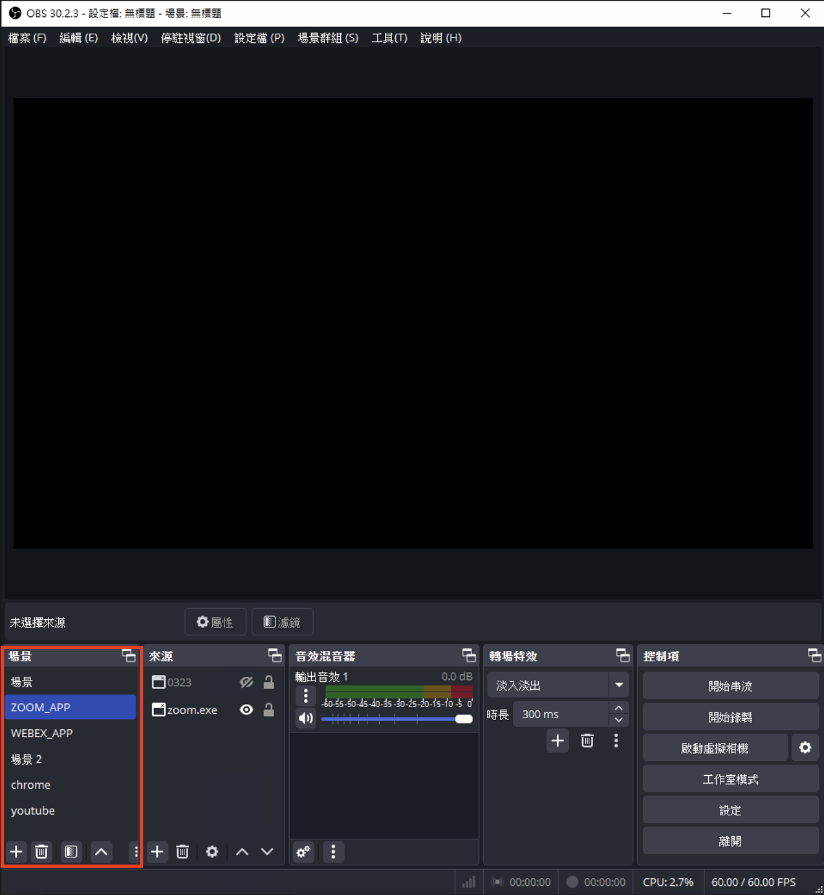

# Recording-Meeting

- [Introduciton](#introduciton)
- [Prerequisite](#prerequisite)
- [Getting Started](#getting-started)
  - [下載程式](#下載程式)
  - [開始使用](#開始使用)
- [Configuration](#configuration)
  - [Email Configuration for sender](#email-configuration-for-sender)
  - [Webex Points Configuration](#webex-points-configuration)
  - [Application Path Configuration](#application-path-configuration)

## Introduciton

此專案為線上會議自動錄製軟體，會議軟體限制為`Webex`, `Zoom` ，使用**PyQt6**開發桌面應用及**FastApi**後端。

## Prerequisite

此專案使用`UV`管理 python 專案，建議先安裝`UV`。

- 詳細安裝請參考：[https://docs.astral.sh/uv/getting-started/installation/](https://docs.astral.sh/uv/getting-started/installation/)

- Windows 快速安裝

  ```powershell
  powershell -ExecutionPolicy ByPass -c "irm https://astral.sh/uv/install.ps1 | iex"
  ```

  確認安裝成功

  ```powershell
  uv -V
  ```

## Getting Started

### 下載程式

1. 請先clone此專案

   ```bash
   # 開啟終端機，進入目標資料夾 (可以直接複製檔案總管上的路徑)。
   # or
   # 在檔案總管上開啟你想要放的資料夾，再在路徑的地方輸入"cmd"，按下enter，就會開啟對應資料夾的終端機

   cd <target folder>  # ex: u"C:\Users\linlab\Documents"
   ```

   接著clone專案：

   ```bash
   # 將 <repository_url> 替換為您的專案倉庫 URL

   git clone https://github.com/leeeating/Recording-Meeting.git

   # wait cloning ...

   cd ./Recording-Meeting
   ```

1. 安裝依賴
   ```bash
   uv install
   ```

### 開始使用

請依照以下步驟在本地啟動後端伺服器，再使用桌面應用GUI安排會議錄製。
以下提供**手動執行**及**批次執行(.bat)**

p.s. 小四電腦中已經設定好使用**批次執行(.bat)**

<details>
<summary>A. 開啟終端機手動執行</summary>

- Backend: 重複執行會報錯

  ```bash
  cd ${PROJECT_ROOT}  # ex: C:\Users\linlab\Documents\Recording-Meeting
  uv run uvicorn app.main:app --reload # 重複執行會報錯
  ```

  也可以使用 start 命令讓後端伺服器無視窗的在後台執行。

  ```bash
  start "" uv run uvicorn app.main:app --reload
  ```

- Frontend

  ```bash
  cd ${PROJECT_ROOT}  # ex: C:\Users\linlab\Documents\Recording-Meeting
  uv run python -m frontend.UI
  ```

</details>

<br>
<br>

B. 在**桌面**建立兩個`.bat`檔案，分別寫入以下指令，以後直接在桌面點擊執行。
<mark> `<path to project>` 需要改成存放此專案的路徑 </mark>

- Backend

  ```bat
  @echo off
  cd <path to project>
  powershell -windowstyle hidden -command "Start-Process uv -ArgumentList 'run uvicorn app.main:app --reload' -WindowStyle Hidden"
  exit
  ```

- Frontend

  ```bat
  @echo off
  cd <path to project>
  powershell -windowstyle hidden -command "Start-Process uv -ArgumentList 'run pythonw -m frontend.UI' -WindowStyle Hidden"
  exit
  ```

## Configuration

### Email Configuration for sender

此專案需要自動寄送 Gmail，因此需要事先設定寄件者的 Gmail 帳號及密碼，才能使用程式自動寄送

設定步驟如下

1. 進入帳號管理頁面
   

2. 搜尋`應用程式密碼`
   

3. 設定並紀錄`應用程式密碼`，名字可以隨便取，<mark>產生的密碼要保存</mark>。

   

4. 寫入`.env`檔

   在.env中找到對應的變數更改數值

   ```ini
   DEFAULT_USER_EMAIL="account@gmail.com"
   EMAIL_APP_PASSWORD="password"
   ```

### Webex Points Configuration

在 webex 模式中需要設定滑鼠點擊位置，在其他電腦設定時需要下載[**Accessibility Insights For Windows**](https://accessibilityinsights.io/downloads/)。

先隨便開啟一個會議，將整個視窗最大化後，再將滑鼠游標移到三個不同的 Layout 上，紀錄程式中顯示的座標(直接複製貼上原始字串，不用額外處理)。
最後貼到`.env`檔中對應的變數中(`WEBEX_GRID_POINT`, `WEBEX_STACKED_POINT`, `WEBEX_SIDE_BY_SIDE_POINT`)。

p.s.: 滑鼠移動到元件上面，需要顯示藍色外框才算偵測成功


### Application Path Configuration

1.  需要找出`webex`, `zoom`, `obs`的執行路徑，以及OBS中的場景設定名稱

    進入.env設定 　`WEBEX_APP_PATH`, `ZOOM_APP_PATH`, `OBS_PATH`

    可以先在電腦上確認以下路徑是否有該Application

    p.s.: `<user name>`為變數，每台電腦的設定都不一樣

    <details>
    <summary>如何使用指令找出路徑</summary>
    程式會遞迴搜尋需要等一下

    ```ini
    OBS_PATH="C:\Program Files\obs-studio\bin\64bit\obs64.exe"
    WEBEX_APP_PATH="C:\Users\<user name>\AppData\Local\CiscoSparkLauncher\CiscoCollabHost.exe"
    ZOOM_APP_PATH="C:\Users\<user name>\AppData\Roaming\Zoom\bin\Zoom.exe"
    ```

    ```powershell
    Get-ChildItem -Path $env:LOCALAPPDATA, $env:APPDATA -Filter "Zoom.exe" -Recurse -ErrorAction SilentlyContinue | Select-Object FullName

    Get-ChildItem -Path $env:LOCALAPPDATA, $env:ProgramFiles -Filter "Webex.exe" -Recurse -ErrorAction SilentlyContinue | Select-Object FullName

    Get-ChildItem -Path $env:LOCALAPPDATA, $env:ProgramFiles -Filter "obs64.exe" -Recurse -ErrorAction SilentlyContinue | Select-Object FullName
    ```

    </details>

<br>

2.  開啟OBS設定針對Zoom或是Webex的場景，名字可以隨便取或是使用 `WEBEX_APP`, `ZOOM_APP`，只需要跟`.env`中一樣就好。
    或是沿用原本的設定

        

        ```ini
        WEBEX_SCENE_NAME="WEBEX_APP"
        ZOOM_SCENE_NAME="ZOOM_APP"
        ```
