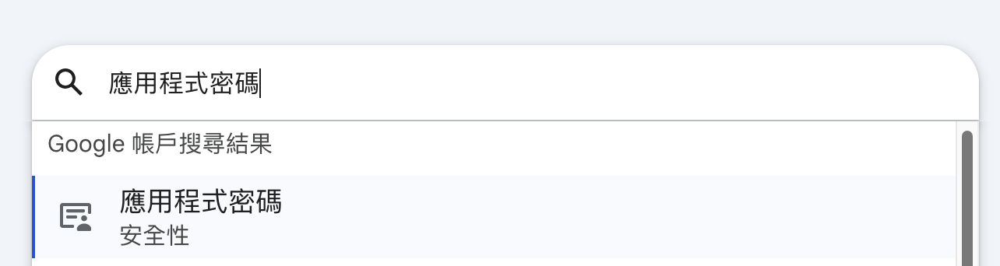
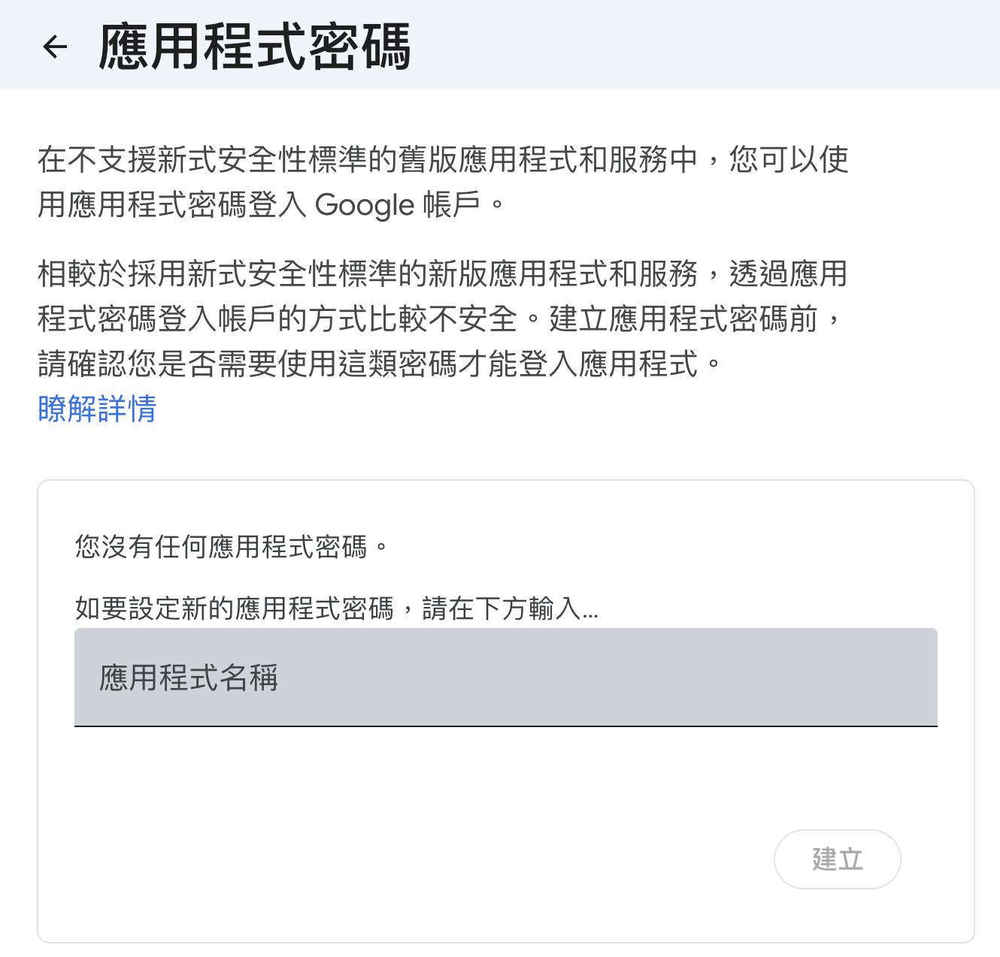
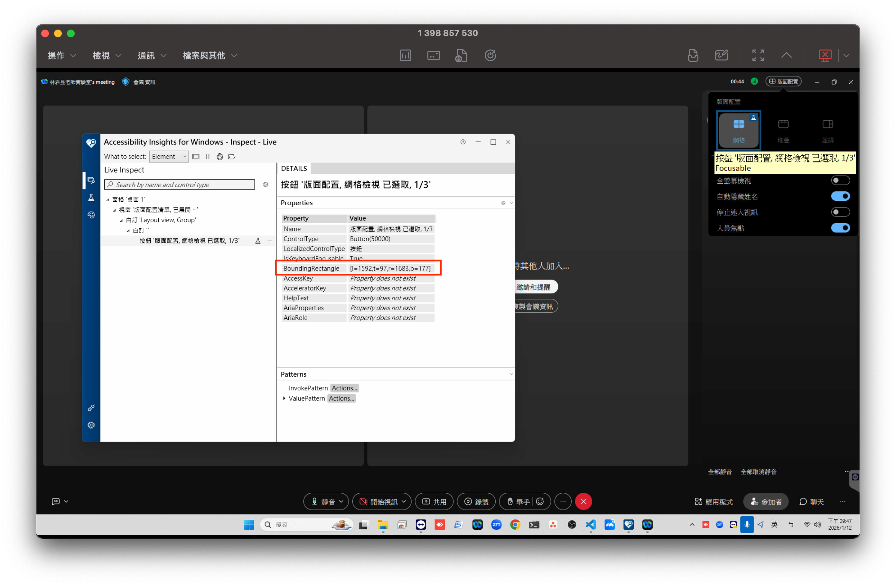

# Recording-Meeting

## Introduciton

此專案為線上會議自動錄製軟體，會議軟體限制為`Webex`, `Zoom` ，使用**PyQt6**開發桌面應用及**FastApi**後端。

此專案使用`UV`管理 python 專案，建先安裝`UV`。

- 詳細安裝請參考：[https://docs.astral.sh/uv/getting-started/installation/](https://docs.astral.sh/uv/getting-started/installation/)

- Windows 快速安裝

  ```powershell
  powershell -ExecutionPolicy ByPass -c "irm https://astral.sh/uv/install.ps1 | iex"
  ```

  確認安裝成功

  ```powershell
  uv -V
  ```

## Getting Started

請先在本地啟動後端伺服器，在開使使用桌面應用安排會議錄製。
以下提供**手動執行**及**批次執行(.bat)**

A. 開啟終端機手動執行

- Backend: 重複執行會報錯

  ```bash
  cd <path to project>    #ex: C:\Users\linlab\Documents\Recording-Meeting
  uv run uvicorn app.main:app --reload
  ```

  也可以使用 start 命令讓後端伺服器無視窗的在後台執行。

  ```bash
  start "" uv run uvicorn app.main:app --reload
  ```

- Frontend

  ```bash
  cd <path to project>    #ex: C:\Users\linlab\Documents\Recording-Meeting
  uv run python -m frontend.UI
  ```

B. 在**桌面**建立兩個`.bat`檔案，分別寫入以下指令，以後直接在桌面點擊執行。

- Backend

  ```bat
  @echo off
  cd C:\Users\linlab\Documents\Recording-Meeting
  powershell -windowstyle hidden -command "Start-Process uv -ArgumentList 'run uvicorn app.main:app --reload' -WindowStyle Hidden"
  exit
  ```

- Frontend

  ```bat
  @echo off
  cd C:\Users\linlab\Documents\Recording-Meeting
  powershell -windowstyle hidden -command "Start-Process uv -ArgumentList 'run pythonw -m frontend.UI' -WindowStyle Hidden"
  exit
  ```

## Configuration

### Email

此專案需要自動寄送 Gemail，因此需要事先設定 Gmail 帳號及密碼，設定步驟如下。

1. 進入帳號管理頁面
   

2. 搜尋`應用程式密碼`
   

3. 設定並紀錄`應用程式密碼`

   

4. 寫入`.env`檔

```bash
DEFAULT_USER_EMAIL="account@gmail.com"
EMAIL_APP_PASSWORD="password"
```

### Webex

在 webex 中模式中需要設定滑鼠點擊位置，在其他電腦設定時需要下載[**Accessibility Insights For Windows**](https://accessibilityinsights.io/downloads/)。

先隨便開啟一個會議，將整個視窗最大化後，再將滑鼠游標移到三個不同的 Layout 上，紀錄程式中顯示的座標(直接複製貼上原始字串，不用額外處理)。
最後貼到`.env`檔中對應的變數中(`WEBEX_GRID_POINT`, `WEBEX_STACKED_POINT`, `WEBEX_SIDE_BY_SIDE_POINT`)。

p.s.: 滑鼠移動到元件上面，需要顯示藍色外框才算成功


